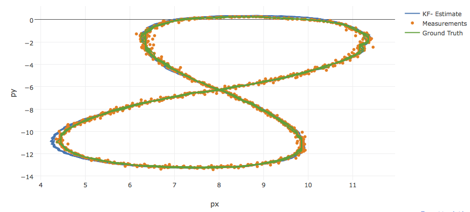
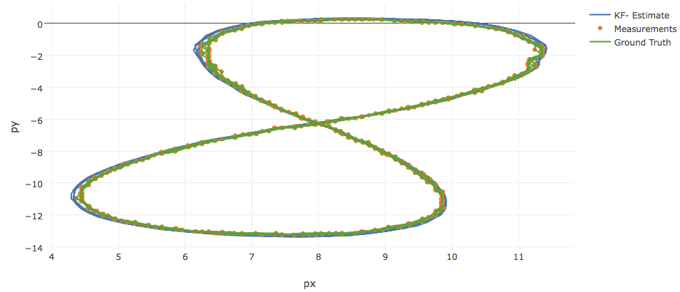
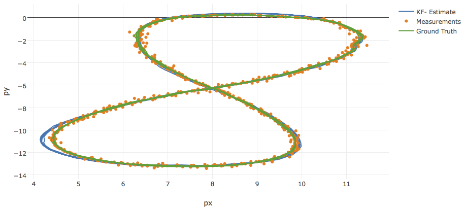
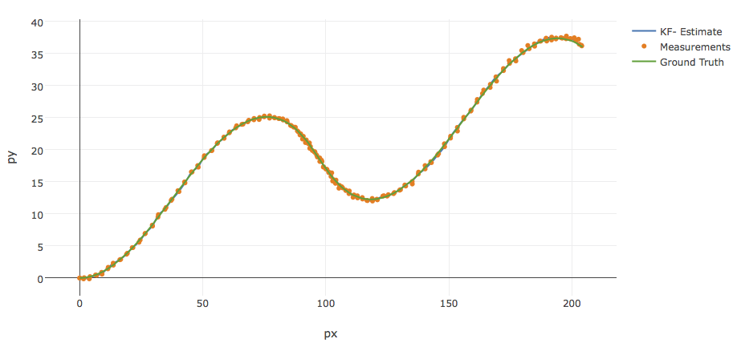
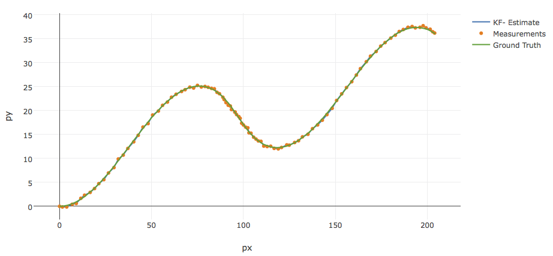
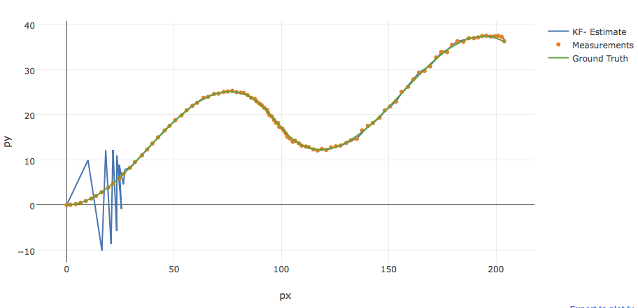

# Extended Kalman Filter
This Project first project of second term of Udacity Self-Driving Car Nanodegree program. The goal is to apply Extended Kalman Filter to data from LIDAR and RADAR sensors by C++.

## Content
- `scr` contains source code:
  - `main.cpp` - loads data, calls a function to run the Kalman filter, calls a function to calculate RMSE
  - `fusion_ekf.cpp` - initializes the filter, calls the predict function, calls the update function
  - `kalman_filter.cpp`- defines the predict function, the update function for lidar, and the update function for radar
  - `tools.cpp` - a function to calculate RMSE and the Jacobian matrix
- `data` a directory with two input files, provided by Udacity
- `result` a directory with output files, log files and output charts
- `docs` a directory with files formats description

## Results
In order to see how sensor data impact accuracy of Kalman Filter, I run the algorithm on two data input (porvided by Udacity) with three calculations: 
1. Lidar and Radar measurements are considered
2. Only Lidar measurements are considered
3. Only Radar measurements are considered

Here is the RMSEs comparion of expected and above calculations:

### Data 1
|   RMSE    | px | py | vx | vy |
| --------- | -- | -- | -- | -- |
| Threshold | 0.08 | 0.08 | 0.60 | 0.60 |
| Radar + Lidar | 0.0655724 | 0.0624793 | 0.534247 | 0.54817 |
| Lidar | 0.0681865 | 0.0607532 | 0.625587 | 0.570902 |
| Radar | 0.10121 | 0.0823387 | 0.601316 | 0.581942 |

#### Radar and Lidar measurements are considered

#### Only Lidar measurements are considered

#### Only Radar measurements are considered

### Data 2
|   RMSE    | px | py | vx | vy |
| --------- | -- | -- | -- | -- |
| Threshold | 0.20 | 0.20 | 0.50 | 0.85 |
| Radar + Lidar | 0.185609 | 0.189915 | 0.473388 | 0.776187 |
| Lidar | 0.217995 | 0.19416 | 0.93745 | 0.800829 |
| Radar | 2.80105 | 2.67625 | 3.83749 | 4.39577 |

#### Radar and Lidar measurements are considered

#### Only Lidar measurements are considered

#### Only Radar measurements are considered

The results were visualized with [Sensor Fusion utilities](https://github.com/udacity/CarND-Mercedes-SF-Utilities).

## Lessons Learned
- Considering both sensor data (LIDAR and RADAR) give much better accuracy
- Lidar sensor give better measurement (I think lidar sensor noises are less)
- 
